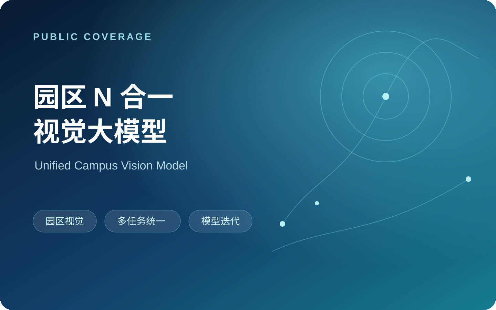

# Lichen Zhao · 赵立晨

**Co-founder & CTO at [Lagrange](https://lagrangex.com)** 
Building **Physical Agent Infra** for agents that work in the real world.

> 从真实场景闭环出发，构建 Agentic OS，走向 Physical RSI。

## Agent

| Lagrange · Physical Agent Infra | Huawei AI 智家宝 · Smart Home IoT Agent | HomeAssistant LLM Analysis |
| --- | --- | --- |
|  |  |  |

## 3D

| 3DVG-Transformer | 3DJCG / 3DVL Codebase | Transformer3D-Det | FE-3DGQA · 3D Visual Question Answering |
| --- | --- | --- | --- |
|  |  |  |  |

## Multimodal

| DeCLIP | Huawei Campus N-in-One Vision Model | Huawei FTTR-NAS Semantic Search |
| --- | --- | --- |
|  |  |  |

## Algorithms & competitions

| Huawei Algorithm Competition · VectorSearch | Huawei Hackathon · Cluster Scheduling | Codeforces Grandmaster · ACM-ICPC / CCPC Templates |
| --- | --- | --- |
|  |  |  |
