# Lichen Zhao · 赵立晨

**Co-founder & CTO at [Lagrange](https://lagrangex.com)** 
Building **Physical Agent Infra** for agents that work in the real world.

> 从真实场景闭环出发，构建 Agentic OS，走向 Physical RSI。

## Agent

<table width="100%">
  <tr>
    <td width="33.33%" align="center"><strong>Physical Agent Infra</strong> Lagrange · 2026–Present</td>
    <td width="33.33%" align="center"><strong>AI 智家宝 · Smart Home IoT Agent</strong> Huawei · 2025–2026</td>
    <td width="33.33%" align="center"><strong>HomeAssistant LLM Analysis</strong> Personal · 2025</td>
  </tr>
  <tr>
    <td width="33.33%"></td>
    <td width="33.33%"></td>
    <td width="33.33%"><a href="https://github.com/zlccccc/HomeAssistant-LLM-Analysis">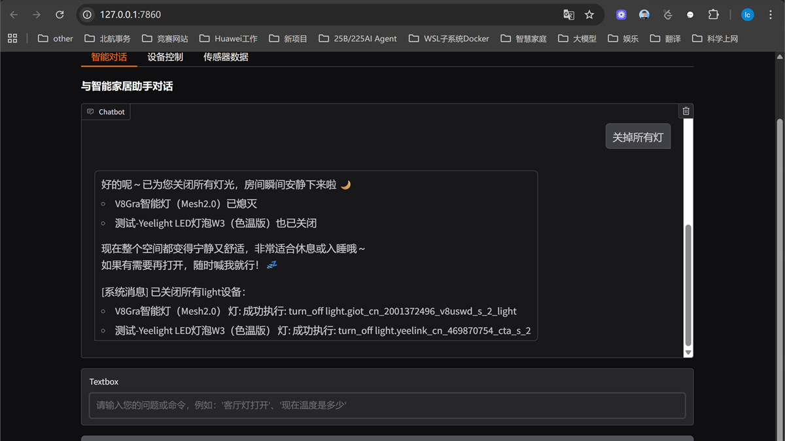</a></td>
  </tr>
</table>

## Multimodal

<table width="100%">
  <tr>
    <td width="25%" align="center"><strong>DeCLIP · VL Pre-training</strong> SenseTime · 2021–2022</td>
    <td width="25%" align="center"><strong>INTERN · General Vision System</strong> SenseTime · 2021</td>
    <td width="25%" align="center"><strong>HoloSens N-in-One Model</strong> Huawei · 2023–2024</td>
    <td width="25%" align="center"><strong>FTTR-NAS Semantic Search</strong> Huawei · 2024–2025</td>
  </tr>
  <tr>
    <td width="25%"><a href="https://github.com/Sense-GVT/DeCLIP">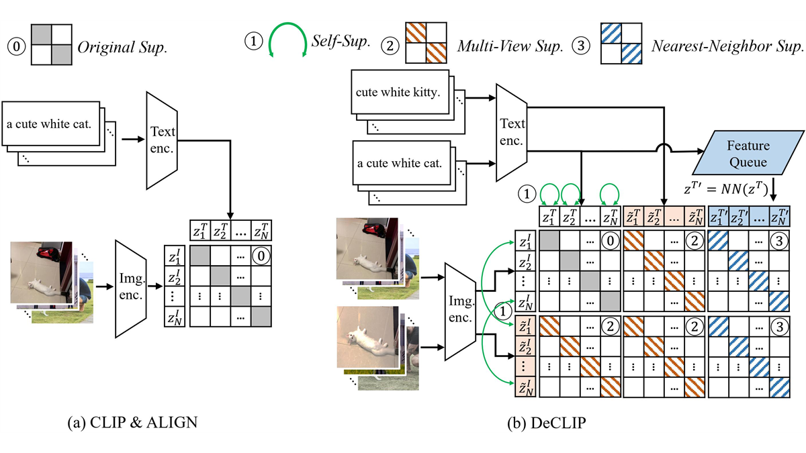</a></td>
    <td width="25%"><a href="https://www.sensetime.com/cn/news/41164398">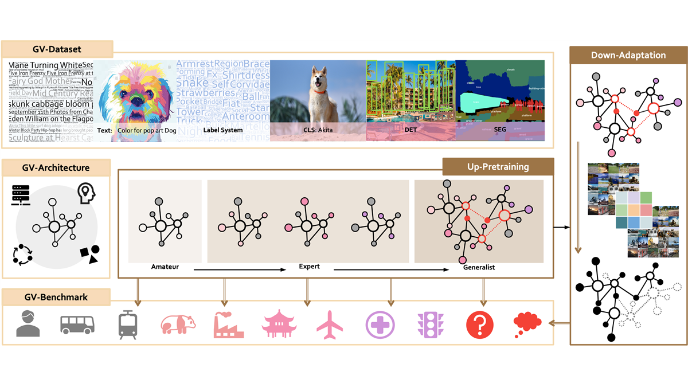</a></td>
    <td width="25%"><a href="https://mp.weixin.qq.com/s/vSR_kvJDO61ZGdzVi4cHtw">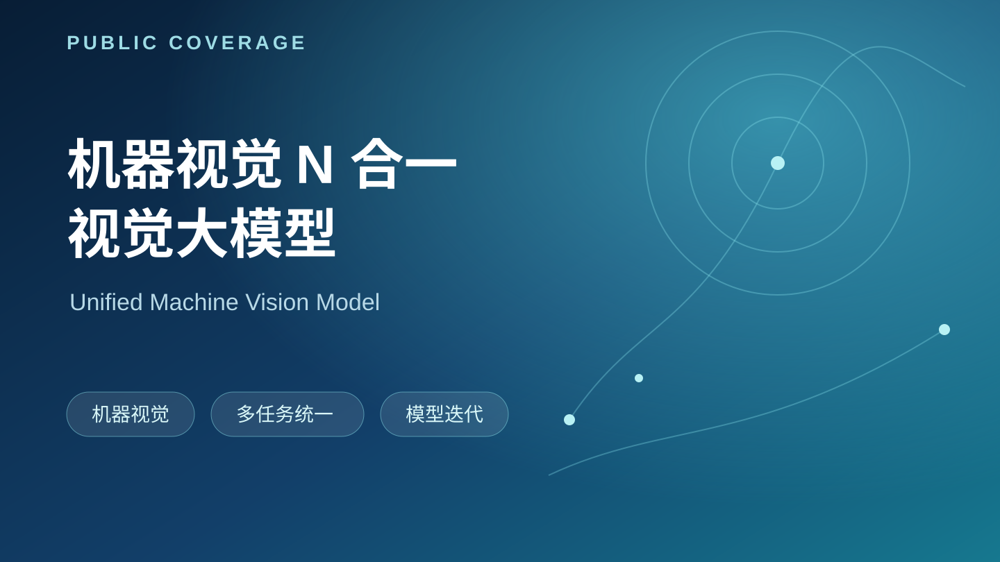</a></td>
    <td width="25%"><a href="https://jdc.huawei.com/jdc/refactor/viewthread?tid=1138557">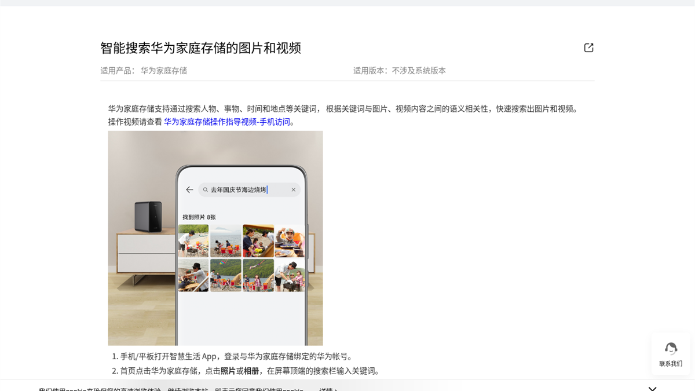</a></td>
  </tr>
</table>

## 3D

<table width="100%">
  <tr>
    <td width="25%" align="center"><strong>3DVG-Transformer</strong> Beihang · ICCV 2021</td>
    <td width="25%" align="center"><strong>3DJCG / 3DVL Codebase</strong> Beihang · CVPR 2022 Oral</td>
    <td width="25%" align="center"><strong>Transformer3D-Det</strong> Beihang · T-CSVT 2021</td>
    <td width="25%" align="center"><strong>FE-3DGQA</strong> Beihang · T-CSVT 2022</td>
  </tr>
  <tr>
    <td width="25%"><a href="https://github.com/zlccccc/3DVG-Transformer">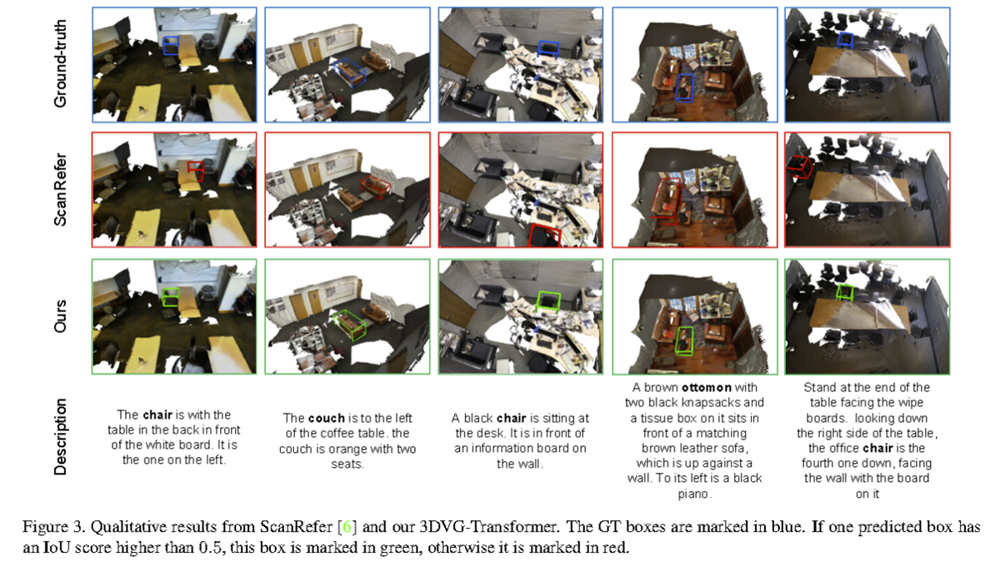</a></td>
    <td width="25%"><a href="https://github.com/zlccccc/3DVL_Codebase">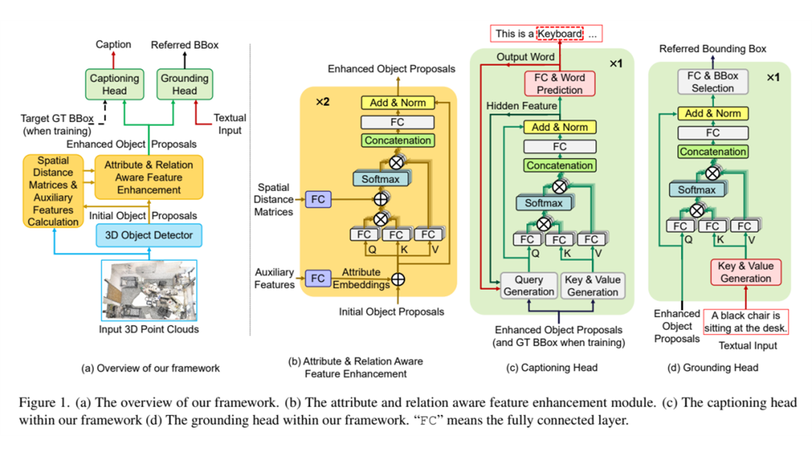</a></td>
    <td width="25%"><a href="https://github.com/zlccccc/Transformer3D-Det">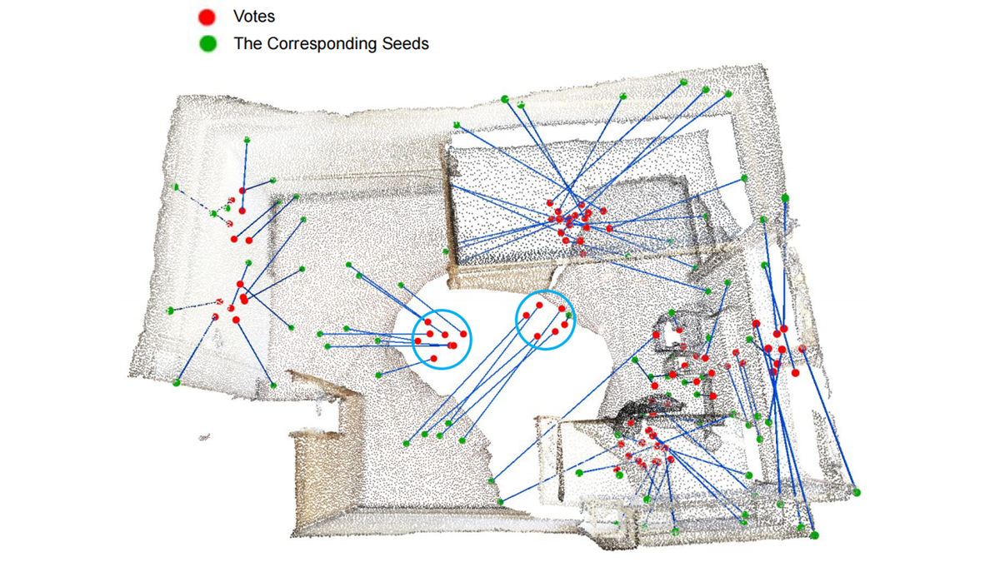</a></td>
    <td width="25%"><a href="https://arxiv.org/abs/2209.12028">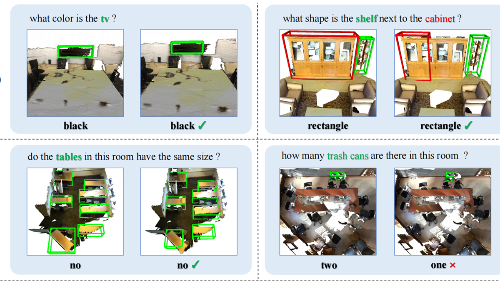</a></td>
  </tr>
</table>

## Algorithms & competitions

<table width="100%">
  <tr>
    <td width="33.33%" align="center"><strong>Huawei Algorithm Competition · VectorSearch</strong> Huawei · 2024 · Runner-up</td>
    <td width="33.33%" align="center"><strong>Huawei Hackathon · Cluster Scheduling</strong> Huawei · 2024 · First Prize</td>
    <td width="33.33%" align="center"><strong>ACM-ICPC / CCPC</strong> Personal · 2017–2021 · Codeforces Grandmaster</td>
  </tr>
  <tr>
    <td width="33.33%"><a href="https://github.com/zlccccc/VectorSearch-RNNDescent">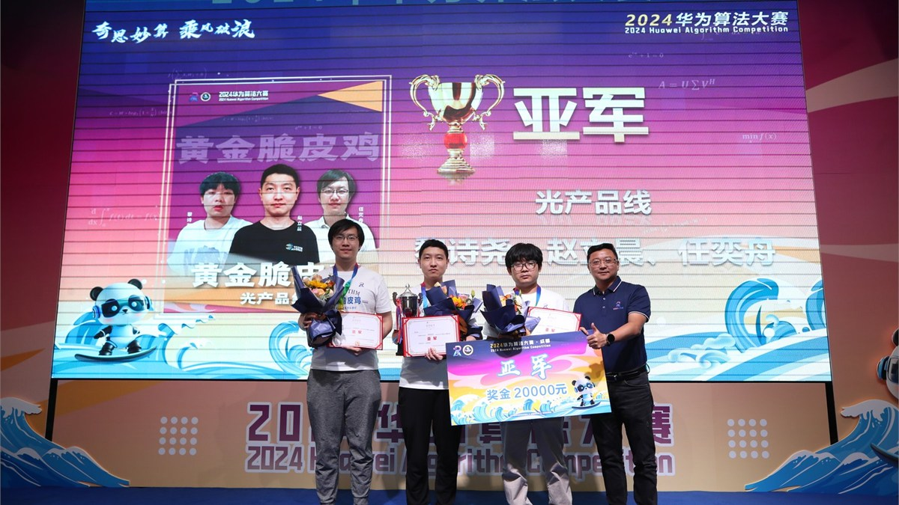</a></td>
    <td width="33.33%"><a href="assets/huawei-hackathon.jpg">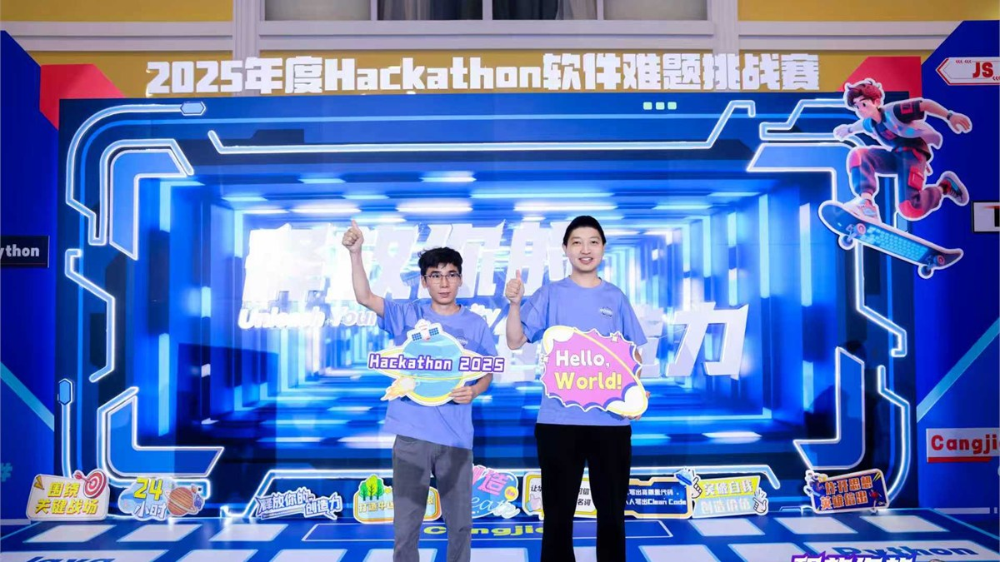</a></td>
    <td width="33.33%"><a href="https://github.com/zlccccc/ACM-Templates-by-zlc1114">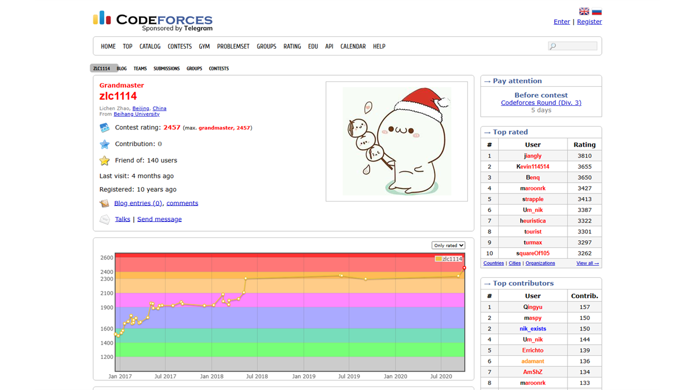</a></td>
  </tr>
</table>
