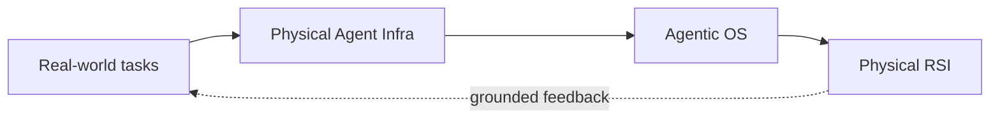

# Lichen Zhao · 赵立晨

**Co-founder & CTO at [Lagrange](https://lagrangex.com)** 
Building **Physical Agent Infra** for agents that work in the real world.

> 从真实场景闭环出发，构建 Agentic OS，走向 Physical RSI。

I work across four connected directions: **Agent systems, 3D intelligence, multimodal learning, and algorithms**. My projects range from research and open-source prototypes to production systems operating in homes and industrial sites.

## Agent systems & physical intelligence

At Lagrange, I work on the infrastructure between foundation models, robots, and real operations: task orchestration, runtime state, device capabilities, traces, evaluation, recovery, and learning from grounded feedback.

**AI 智家宝 · Smart Home IoT Agent** — At Huawei, I led the edge-cloud Agent architecture connecting natural-language interaction, household IoT devices, and cross-device memory in a production product. The central problem was making an agent reliably operate a real environment—not merely answer questions.

- [产品报道：AI 智家宝](https://mp.weixin.qq.com/s/lBcIl0Y1rm71hQ4QlfgOeA) · [Agent 功能演示](https://www.bilibili.com/video/BV1zonnz4EEn/)
- [AI-ON](https://baijiahao.baidu.com/s?id=1844030784767498455) · [AI-OTN industry report](https://www.geekpark.net/news/354038) · [Huawei AI-OTN](https://www.huawei.com/cn/news/2025/9/ai-otn-pt-expo)
- [HomeAssistant-LLM-Analysis](https://github.com/zlccccc/HomeAssistant-LLM-Analysis) — a separate public prototype for LLM-driven smart-home control and system analysis; it is not the Huawei product source code.
- [Agentic-AI-Workflow-Simulator](https://github.com/zlccccc/Agentic-AI-Workflow-Simulator) — DAG scheduling and heterogeneous-resource experiments for multi-step agent workflows.

  

## 3D perception & grounding

I build systems that connect language to objects, relations, and actions in 3D scenes. The work spans model design, point-cloud perception, grounding, captioning, visualization, and reusable research code.

| 3D visual grounding | Joint 3D captioning & grounding |
| --- | --- |
|  |  |
| [3DVG-Transformer](https://github.com/zlccccc/3DVG-Transformer) · ICCV 2021 | [3DVL Codebase](https://github.com/zlccccc/3DVL_Codebase) · CVPR 2022 Oral |

[Transformer3D-Det](https://github.com/zlccccc/Transformer3D-Det) applies Transformer-based vote refinement to 3D object detection and was published in T-CSVT.

## Multimodal learning

My multimodal work focuses on learning transferable visual-language representations and connecting large-scale pre-training to downstream perception tasks.

- [DeCLIP](https://github.com/Sense-GVT/DeCLIP) — data-efficient contrastive language-image pre-training · ICLR 2022
- [INTERN](https://zhuanlan.zhihu.com/p/434394374) — public introduction to large-scale multimodal pre-training work
- The 3D grounding and captioning projects above extend the same language-perception problem into spatial scenes.

## Algorithms & competitions

Algorithmic problem solving remains part of how I approach systems: define the bottleneck, understand the data structure, and optimize the full path rather than a single component.

- **Competitive programming:** Codeforces Grandmaster; 6 ICPC/CCPC regional gold medals, including 2 Asia EC-Final gold medals · [Codeforces](https://codeforces.com/profile/zlc1114) · [Nowcoder](https://ac.nowcoder.com/acm/contest/profile/1652702) · [LeetCode](https://leetcode.cn/u/lichen-7i/)
- **Large-scale vector search:** RNN-Descent, quantization, PCA, and SIMD optimization · [project](https://github.com/zlccccc/VectorSearch-RNNDescent) · [competition ranking](https://competition.huaweicloud.com/information/1000042156/ranking) · [technical coverage](https://finance.sina.com.cn/jjxw/2025-03-05/doc-inenqhuv2070150.shtml)

## About

I am a co-founder and CTO at Lagrange. I previously worked on edge-cloud Agent systems at Huawei and multimodal and 3D intelligence at SenseTime. I hold M.Eng. and B.Eng. degrees in Software Engineering from Beihang University.
