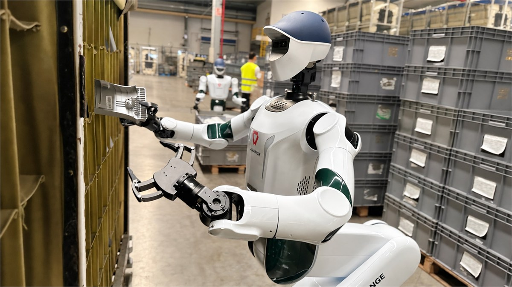

# Lichen Zhao · 赵立晨

**Co-founder & CTO at [Lagrange](https://lagrangex.com)** 
Building **Physical Agent Infra** for agents that work in the real world.

> 从真实场景闭环出发，构建 Agentic OS，走向 Physical RSI。

## Agent

| Lagrange · Physical Agent Infra | AI 智家宝 · Smart Home IoT Agent |
| --- | --- |
|  |  |
| HomeAssistant LLM Analysis | Agentic AI Workflow Simulator |
|  |  |

## 3D

| 3DVG-Transformer | 3DJCG / 3DVL Codebase |
| --- | --- |
|  |  |

## Multimodal

| DeCLIP |
| --- |
|  |

## Algorithms & competitions

| VectorSearch RNN-Descent | ACM-ICPC / CCPC Templates |
| --- | --- |
|  |  |
