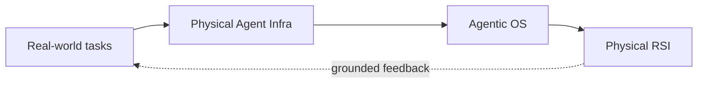

# Lichen Zhao · 赵立晨

**Co-founder & CTO at [Lagrange](https://lagrangex.com)** 
Building **Physical Agent Infra** for agents that work in the real world.

> 从真实场景闭环出发，构建 Agentic OS，走向 Physical RSI。

My path has moved from competitive programming and 3D vision-language research, through multimodal pre-training and production edge-cloud agents, to physical-world agent infrastructure.

## Building now · 拉格朗日具身

At Lagrange, I work on the infrastructure between foundation models, robots, and real operations: task orchestration, runtime state, device capabilities, traces, evaluation, recovery, and learning from grounded feedback.

## Systems & products

### AI 智家宝 · Smart Home IoT Agent

At Huawei, I led the edge-cloud Agent architecture behind **AI 智家宝**, connecting natural-language interaction, household IoT devices, and cross-device memory in a production product. It represents my work on making an agent reliably operate a real environment—not merely answer questions.

- [产品报道：AI 智家宝](https://mp.weixin.qq.com/s/lBcIl0Y1rm71hQ4QlfgOeA)
- [Agent 功能演示](https://www.bilibili.com/video/BV1zonnz4EEn/)
- [HomeAssistant-LLM-Analysis](https://github.com/zlccccc/HomeAssistant-LLM-Analysis) — a separate public prototype exploring LLM-driven smart-home control and system analysis; it is not the Huawei product source code.

  

### Agentic AI Workflow Simulator

[Agentic-AI-Workflow-Simulator](https://github.com/zlccccc/Agentic-AI-Workflow-Simulator) explores DAG scheduling, heterogeneous resources, and workload trade-offs for agent workflows—the systems side of turning multi-step agent plans into dependable execution.

## Earlier technical foundations

Before physical agents, I worked on multimodal pre-training and 3D scene understanding. These projects built the perception and grounding foundation for my current systems work.

| 3D visual grounding | Joint 3D captioning & grounding |
| --- | --- |
|  |  |
| [3DVG-Transformer](https://github.com/zlccccc/3DVG-Transformer) · ICCV 2021 | [3DVL Codebase](https://github.com/zlccccc/3DVL_Codebase) · CVPR 2022 Oral |

Also: [DeCLIP](https://github.com/Sense-GVT/DeCLIP) · ICLR 2022, and [Transformer3D-Det](https://github.com/zlccccc/Transformer3D-Det) · T-CSVT 2021.

## Selected public references

- **Edge-cloud agents & AI systems:** [AI-ON](https://baijiahao.baidu.com/s?id=1844030784767498455) · [AI-OTN industry report](https://www.geekpark.net/news/354038) · [Huawei AI-OTN](https://www.huawei.com/cn/news/2025/9/ai-otn-pt-expo)
- **Multimodal pre-training:** [INTERN](https://zhuanlan.zhihu.com/p/434394374)
- **Large-scale vector search:** [competition ranking](https://competition.huaweicloud.com/information/1000042156/ranking) · [technical coverage](https://finance.sina.com.cn/jjxw/2025-03-05/doc-inenqhuv2070150.shtml)
- **Competitive programming:** [Codeforces](https://codeforces.com/profile/zlc1114) · [Nowcoder](https://ac.nowcoder.com/acm/contest/profile/1652702) · [LeetCode](https://leetcode.cn/u/lichen-7i/)

## Background

- **Lagrange** — Co-founder & CTO, 2026–present
- **Huawei** — Data & AI algorithms; edge-cloud Agent systems, 2023–2026
- **SenseTime** — Multimodal pre-training, 3D vision, and production vision systems, 2019–2022
- **Beihang University** — M.Eng. and B.Eng. in Software Engineering
- **Competitive programming** — Codeforces Grandmaster; 6 ICPC/CCPC regional gold medals, including 2 Asia EC-Final gold medals
